## cocos creator 小游戏

参考了各类的小游戏源码和demo,素材来源于网络和一些视频教程

大部分都是学习时做的,可能注释做的不太好,代码会慢慢整理的

主要用于学习,使用的代码量都不大,很适合新人学习.

> 代码供学习使用,请勿用于商业用途

引擎版本 2.4.8

### 游戏列表

像素鸟

| 游戏项目         | 效果图                                                       |
| ---------------- | ------------------------------------------------------------ |
| 合成大西瓜       | 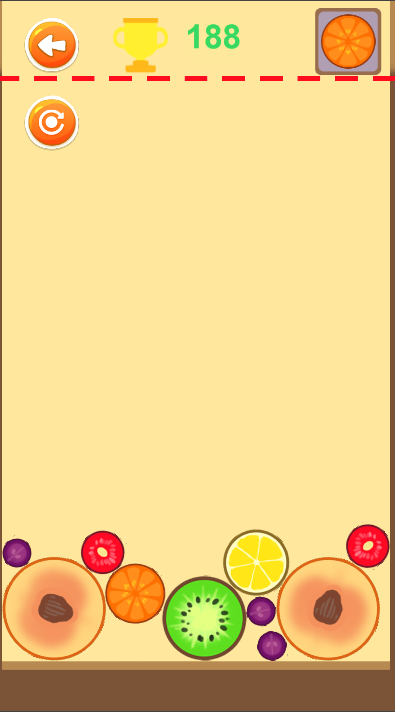 |
| Flappy Bird      |  |
| 见缝插针         | 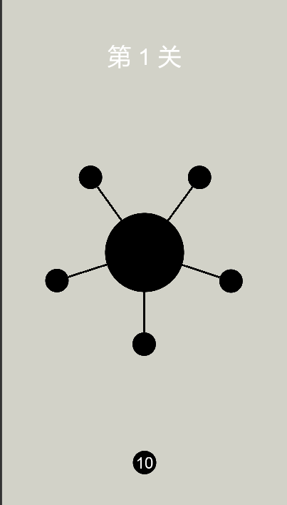 |
| 飞机大战         | 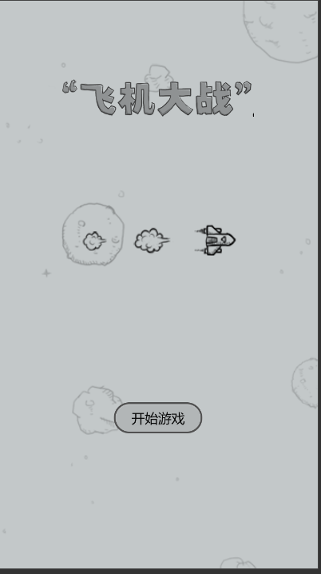 |
| 熊猫跑酷         | 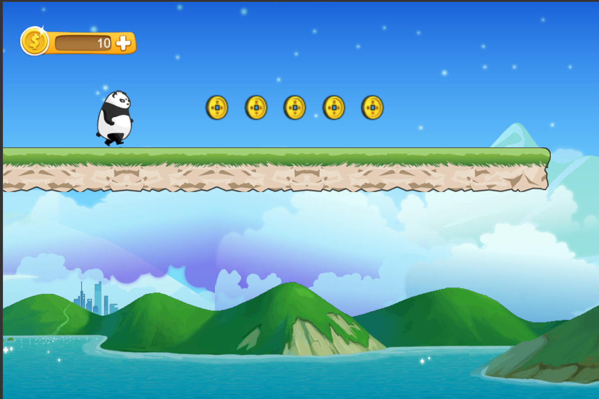 |
| 拼图游戏         | 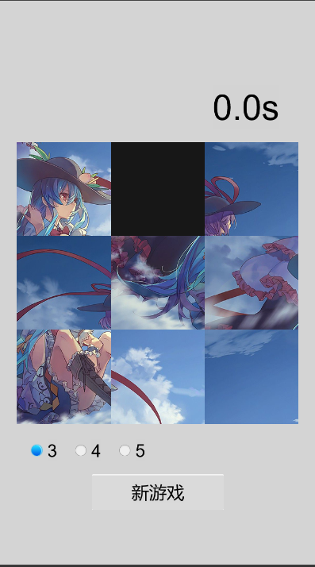 |
| 水果忍者         | 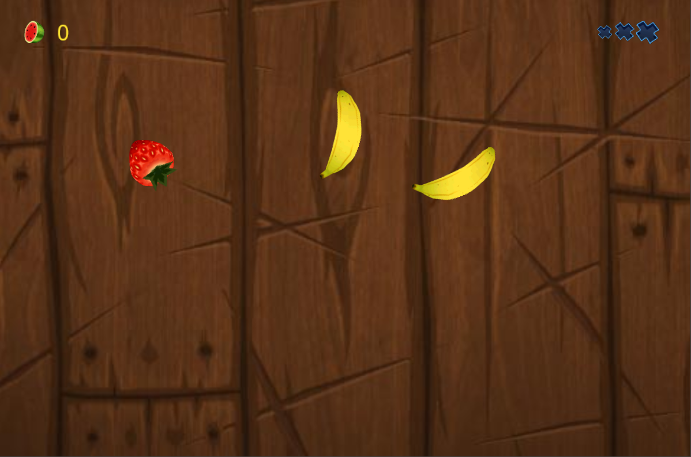 |
| 跳一跳           | 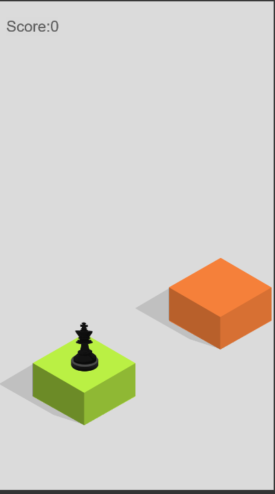 |
| 吃星星(官方例子) | 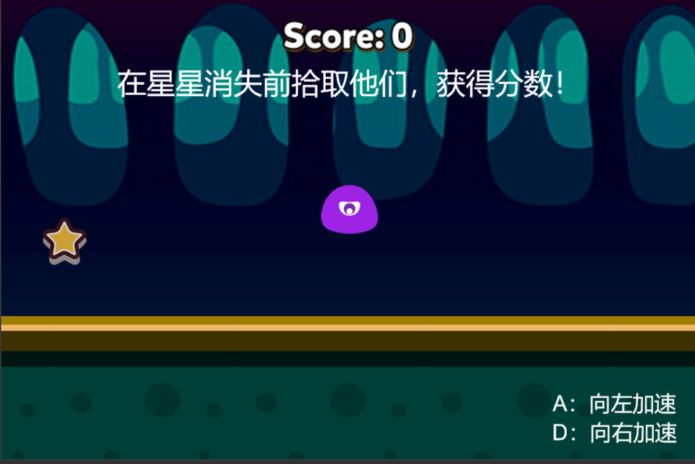 |
| 汉诺塔           | 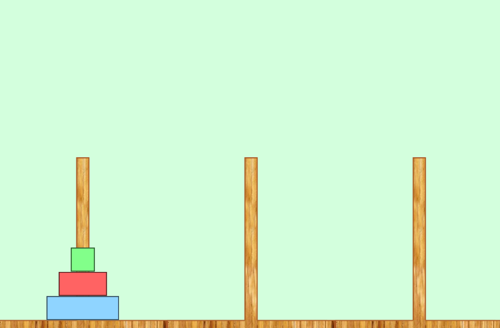 |
| 打砖块           | 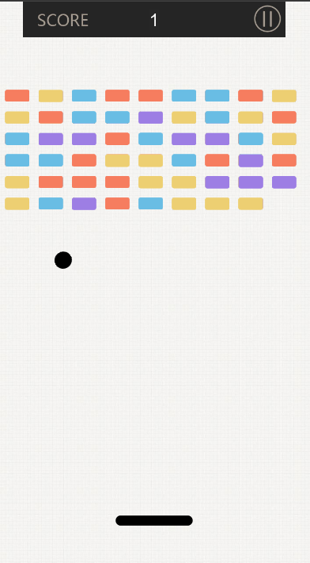 |
| 五子棋           | 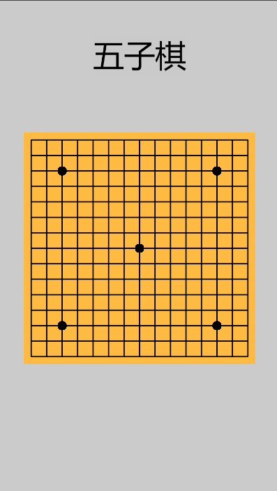 |
| 生命游戏         |  |
| 2D像素小游戏     | 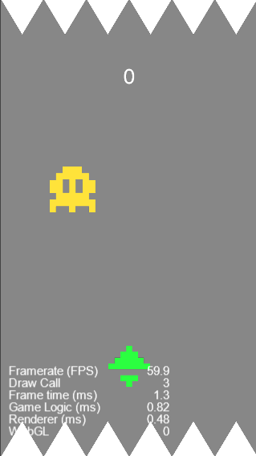 |
